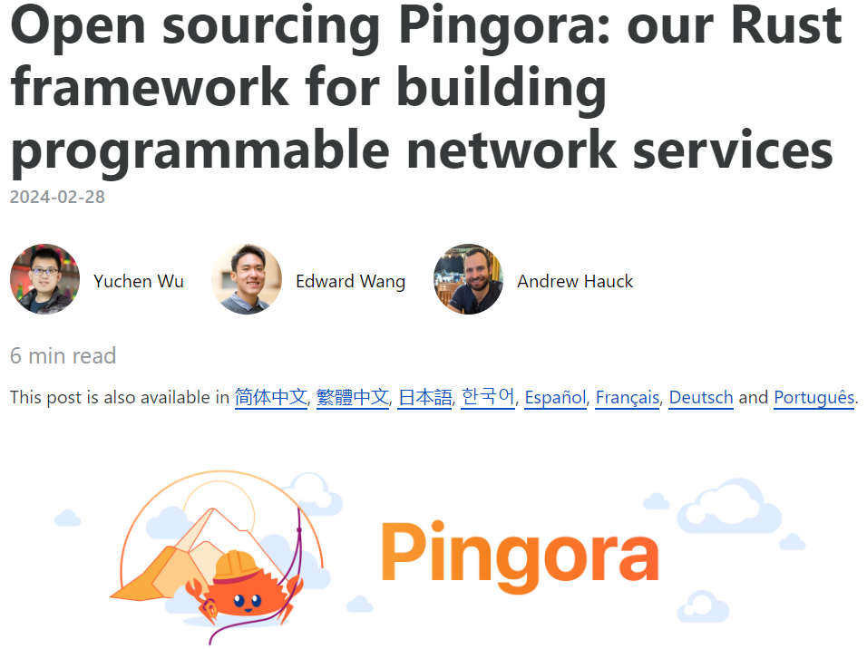
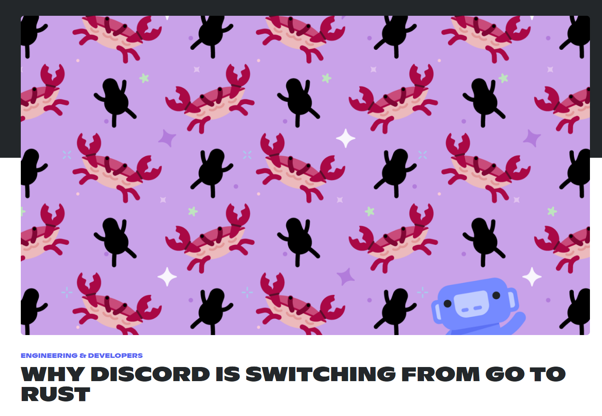
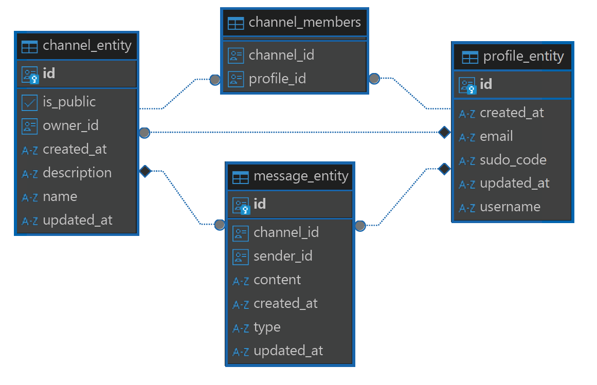
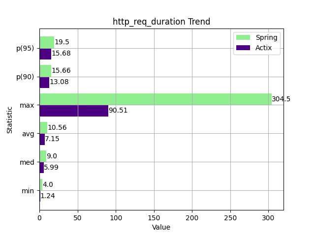
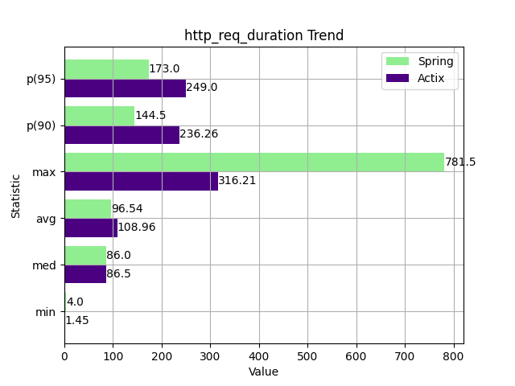
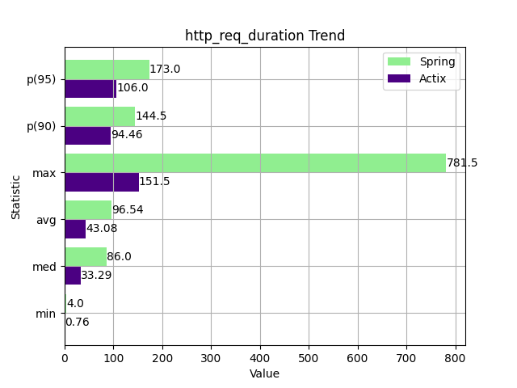
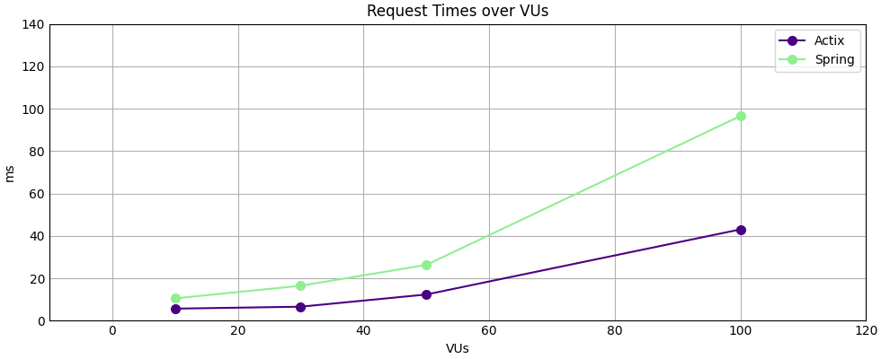
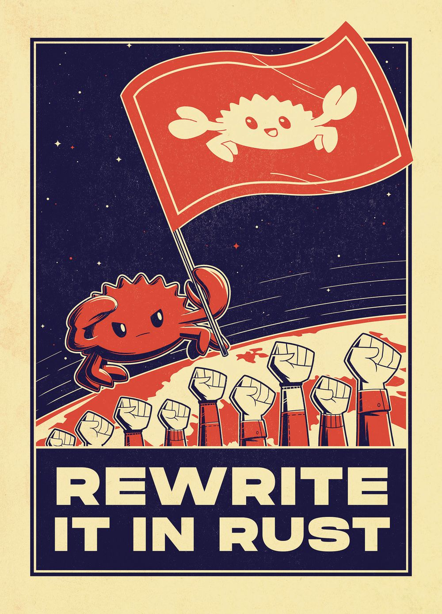

# An evaluation of the current state of Rest API Development in Rust and Java
Marc Matija
26.08.2024

---
# Content
- Motivation
- Scope
- Api Specifications
- Rust Implementation
- Testing
- Comparison
- Conclusion

---

## Motivation
 

---

## Scope
- Build a REST Api With basic CRUD functions
- Build CRUD functions onto a Relational Database
- Test the Performance between Rust and Java in a real world example.

*Building an API that let's users publish messages to channels, retrieve
modify and delete messages and channels.*

---

## Api Specifications
#### Channel endpoints:
- **POST /api/v1/channels**
Creates a new channel with the given name.
- **GET /api/v1/channels/\{id\}**
Retrieves the channel with the given id.
- **GET /api/v1/channels**
Retrieves all channels.
- **PUT /api/v1/channels/\{id\}**
Changes the name of the channel with the given id.
- **DELETE /api/v1/channels/\{id\}**
Deletes the channel with the given id.

---

#### Message endpoints:
- **POST /api/v1/channels/\{id\}/messages**
Adds a new message to the channel with the given id.
- **GET /api/v1/channels/\{id\}/messages/\{id\}**
Retrieves the message with the given id from the channel with the given id.
- **GET /api/v1/channels/\{id\}/messages**
Retrieves all messages from the channel with the given id.
- **PUT /api/v1/channels/\{id\}/messages/\{id\}**
Changes the content of the message with the given id from the channel with the given id.
- **DELETE /api/v1/channels/\{id\}/messages/\{id\}**
Deletes the message with the given id from the channel with the given id.

---

### Database


---

## Rust Implementation
- Actix WEB for capturing HTTP requests
- Sea-ORM for mapping relational data to Rust structs

---

### Actix Web Routing

```Rust
#[get("/api/v1/channels/")]
pub async fn get_all(state: web::Data<ApiState>) -> Result<HttpResponse, Error> {
    let conn = &state.conn;
    let result = ChannelService::get_all_channels(conn).await;
    
    if result.is_err() {
        return handle_error_internal(result.unwrap_err());
    }

    let json_result = serde_json::to_string(&result.unwrap());
    Ok(HttpResponse::Ok()
        .content_type(ContentType::json())
        .body(json_result.expect("Failed to serialize")))
}
```
`backend-actix/api/src/controller/message_controller.rs`

---

### Server Configuration

```Rust
#[actix_web::main]
pub async fn start() -> std::io::Result<()> {
    dotenvy::dotenv().ok();
    let db_url = env::var("DATABASE_URL").expect("DATABASE_URL is not set in .env file");
    let host = env::var("HOST").expect("HOST is not set in .env file");
    let port = env::var("PORT").expect("PORT is not set in .env file");
    let server_url = format!("{host}:{port}");

    let conn = Database::connect(&db_url).await.unwrap();
    let state = ApiState {conn};

    let mut server = HttpServer::new(move || {
        App::new()
            .app_data(web::Data::new(state.clone()))
            .default_service(web::route().to(not_found))
            .configure(init)
    });

    server = server.bind(&server_url)?;
    server.run().await?;

    Ok(())
}
```
`backend-actix/api/src/lib.rs`

---

### Server Configuration
```rust
fn init(cfg: &mut web::ServiceConfig) {
    controller::channel_controller::init(cfg);
    controller::message_controller::init(cfg);
}
```
`backend-actix/api/src/lib.rs`

---
### Services

```rust
pub struct MessageService {}

impl MessageService {
    pub async fn create_message(
        db: &DbConn,
        channel_id: Uuid,
        sender_id: Uuid
    ) -> Result<message_entity::Model, DbErr> {
        let mut new_entity = message_entity::ActiveModel::new();
        new_entity.channel_id = Set(Option::Some(channel_id));
        new_entity.sender_id = Set(Option::Some(sender_id));
        
        let result = new_entity.insert(db).await;
        if result.is_err() {
            match result.as_ref().err() {
                None => return result;
                Some(e) => return result;
            };
        } else{
            return result;
        }
    }
    /* ... */
}
```
`backend-actix/service/src/message.rs`

---
### Services
```rust
pub async fn get_all_messagess(db: &DbConn, channel_id: Uuid) 
    -> Result<Vec<message_entity::Model>, DbErr>
{
    message_entity::Entity::find()
        .filter(message_entity::Column::ChannelId.eq(channel_id))
        .all(db).await
}

```

---

### Entities
- Database created by Spring JPA
  - More information in Documentation file
- Entities exported by Sea-ORM
```sh
sea-orm-cli generate entity -o ./entity
```
- Generates crate with all entities found in database and their relations 

---

### Entities
```rust
#[derive(Clone, Debug, PartialEq, DeriveEntityModel, Eq, Deserialize, Serialize)]
#[sea_orm(table_name = "message_entity")]
#[serde(rename_all = "camelCase")]
pub struct Model {
    pub channel_id: Option<Uuid>,
    #[sea_orm(primary_key, auto_increment = false)]
    pub id: Uuid,
    pub sender_id: Option<Uuid>,
    pub content: String,
    pub created_at: String,
    pub r#type: String,
    pub updated_at: String,
}
```

---

### Entites
```rust
impl ActiveModelBehavior for ActiveModel {
    fn new() -> Self {
        Self{
            id: Set(Uuid::new_v4()),
            content: Set("".to_owned()),
            created_at: Set(get_current_time().to_rfc3339()),
            updated_at: Set(get_current_time().to_rfc3339()),
            r#type:Set("text".to_owned()),
            ..ActiveModelTrait::default()
        }
    }
}
```

---

### Java Implementation
- Same endpoints -> interoperability with tests
- Notes on the exact Springboot implementation can be found in the documentation file.

---

## Testing
- Main Testing tool used was Grafana k6
- JavaScript files describing Testing run
- Automatic creation of Virtual Users (VUs)
- Notes on the exact testing implementation can be found in the documentation file.


---

## Comparisons
 

---

### 100 VUs opt-level 3
- ~50% faster than Java on average
- ~80% faster than Java on max


---



---

### Other Metrics

|              | Build Times | File Size | Memory Usage | Cpu Usage |
|--------------|-------------| --------- |--------------|-----------|
| Springboot   |  22.876s    |  60 Mb    |              |           |
| Actix (ol 0) |  52.85s     |  18 Mb    |              |           |
| Actix (ol 3) |  1m 27s     |  9.7 Mb   |              |           |

---

## Conclusion
- Rust is the overall better performer
- Featureset of Rust Frameworks needs to expand
- Documentation for tools could improve

---
<!-- _class: invert -->

# RUST RAINS SUPREME!


---

# Sources
- https://commons.wikimedia.org/wiki/File:K6-logo.svg
- https://actix.rs/
- https://www.sea-ql.org/SeaORM/
- https://blog.cloudflare.com/pingora-open-source